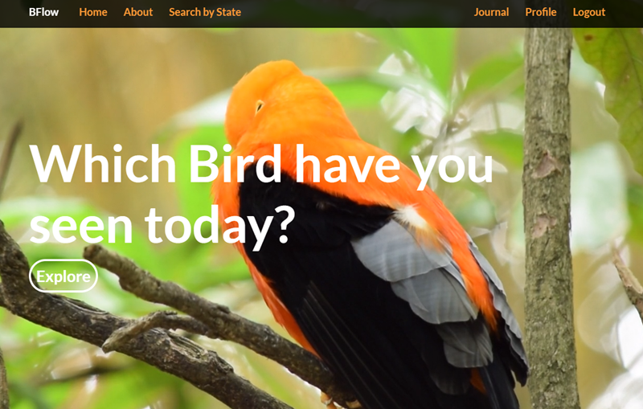

# Bird Flow
Bird Flow is a bird watching journal and informational site, based and inpsired by sites like [eBird](https://ebird.org/home) and [Live Journal](https://www.livejournal.com)

# Project Purpose
As part of our Software Immersive cohort, a group of 5 was assembled to tackle the requirements of this project each focusing on specific front end and/or backend tasks like CRUD. making the frontend of the site appealing smooth to increase user experience, and saving user data to a database created by our backend team using mongodb and mongoose.


# User story 🧐 🤔
1. As a user I want to come to a creative looking sight thats easy to navigate
2. As a user I want to search a bird by State and name.
3. As a user I want to have a journal where I can enter a bird Ive seen and the time Ive seen it.
4. As a user I want to update my journal and delete a entry from my journal.

# How was it Built? 👨🏾‍💻👨🏽‍💻👨🏼‍💻👨🏻‍💻👨🏼‍💻
The boys split up into two teams. The backend created the routes, the database for the user to add a bird that they've seen, as well as putting the time that they've seen it, and the API that gets the data about the birds so once the front end wants to fetch the api the info will be available to them. 

We built out the Journal using routes created on the front end as well using Create, Read, Update, Delete with the axios call from the api on the backend. 

(Example Below)⬇️
``` javascript

const changeNameHandler = (e) => {
    setUserName(e.target.value);
    console.log(userName);
  };
  const changeJournalHandler = (e) => {
    setJournalEntry(e.target.value);
    console.log(journalEntry);
  };
  const changeBirdLocation = (e) => {
    setBirdLocation(e.target.value);
    console.log(birdLocation);
  };


  const submitHandler = e =>{
    e.preventDefault()
    console.log(`Name: ${userName}`)
    console.log(`Journal Entry: ${journalEntry}`)
    console.log(`Location: ${birdLocation}`)
  }
  useEffect(()=>{
    const url = `${REACT_APP_SERVER_URL}/api/journals`
    console.log(localStorage.getItem('jwtToken'))
    axios.get(url, {
      headers: {
        'Authorization': currentUser
      },
    })
    .then(response =>{
      let newJournals = response.data.journal
      // console.log(newJournals)
      // console.log(newJournals[0])
      // console.log(newJournals[1])
      setJournals(newJournals)
      console.log('New journal array from userState')
      
      // setJournals(response.data)
    }).catch(err =>{
      console.log('ERROR in JOURNAL Fetching data from UseEffect')
      console.log(err)
    })
  }, [])

```
Making a few edits to how we did this create route. We were able to complete full crud.


# Build Status
Under development

# Technologies
* HTML
* CSS
* Javascript
* React
* MongoDB and Mongoose as the ODM 

## Screenshots
### Homepage


# Future Considerations


List of future additions and considerations here


# Credits
This project is being worked on by the following extraordinary gentlemen:
* Aaron Prince | [Github](https://github.com/aprin418)
* Chris Rachel | [Github](https://github.com/chrisrachal)
* Maurice Chevez | [Github](https://github.com/mauricechevez)
* Sebastian Gayle | [Github](https://github.com/Purplepro)
* Shawn Dunn | [Github](https://github.com/jshawndunn)

